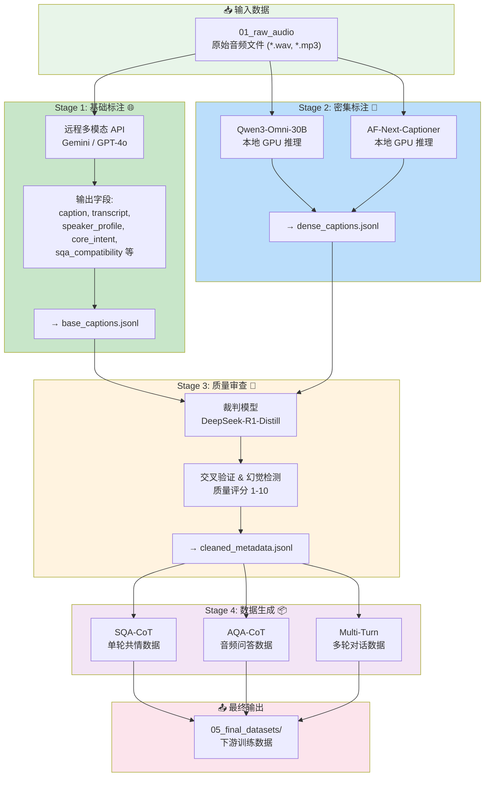

# AF-Chat Emotion & CoT Audio Data Pipeline

端到端多模态音频数据生产流水线：拓源与基础标注 → 双模型密集标注 → 一致性审查 → 下游 SQA/AQA/多轮数据生成。

## 流程概览



## 各阶段说明

| Stage | 名称 | 模型 | 输入 | 输出 | 功能 |
|-------|------|------|------|------|------|
| **Stage 1** | 基础标注 | Gemini / GPT-4o API | 原始音频 | base_captions.jsonl | 生成8个结构化字段（caption、transcript、speaker_profile等） |
| **Stage 2** | 密集标注 | Qwen3-Omni + AF-Next | 原始音频 | dense_captions.jsonl | 双模型本地推理，生成密集音频描述 |
| **Stage 3** | 质量审查 | DeepSeek-R1-Distill (可选3个) | Stage 1+2 输出 | cleaned_metadata.jsonl | 交叉验证、幻觉检测、质量评分、数据过滤 |
| **Stage 4** | 数据生成 | 待实现 | 审查后数据 | 最终训练集 | 生成 SQA-CoT / AQA-CoT / 多轮对话数据 |

### Stage 3 裁判模型选项

| 模型 | 参数量 | 特点 | 推荐场景 |
|------|--------|------|----------|
| DeepSeek-R1-Distill-Qwen-32B | 33B | 中文强，MIT许可 | **默认推荐** |
| DeepSeek-R1-Distill-Llama-70B | 71B | 推理能力最强 | 英文数据、复杂逻辑 |
| Qwen3.5-35B-Claude-Opus-Distilled | 36B | MoE架构，Opus级推理 | 高质量审查 |

## 快速开始

### 1. 部署音频模型
```bash
python deploy_models.py  # 下载 Qwen3-Omni 和 AF-Next
```

### 2. 部署裁判模型（Stage 3）
```bash
python deploy_judge_models.py --model qwen32b     # DeepSeek-R1-Distill-Qwen-32B
python deploy_judge_models.py --model llama70b    # DeepSeek-R1-Distill-Llama-70B
python deploy_judge_models.py --model qwen35b-opus # Qwen3.5-Claude-Opus-Distilled
python deploy_judge_models.py --model all         # 全部下载
```

### 3. 运行流水线
```bash
# Stage 1: 基础标注
python -m src.stage1_captioner

# Stage 2: 密集标注
python -m src.stage2_dense_infer --keep-models-loaded

# Stage 3: 质量审查
python -m src.stage3_reviewer --judge-model qwen32b --force-think

# Stage 4: 数据生成（待实现）
python -m src.stage4_generator
```

### 4. 可视化界面
```bash
python app.py                 # 双模型调试界面 (端口 7860)
python pipeline_visualizer.py # 流程可视化界面 (端口 7861)
```

## 目录结构

```text
caption-generation-qc-pipeline/
├── data/
│   ├── 01_raw_audio/           # 📥 原始音频
│   ├── 02_base_captions/       # 📄 Stage 1 输出
│   ├── 03_dense_captions/      # 📄 Stage 2 输出
│   ├── 04_cleaned_metadata/    # 📄 Stage 3 输出
│   └── 05_final_datasets/      # 📦 Stage 4 最终数据
│       ├── sqa_cot/            # 单轮共情 CoT
│       ├── aqa_cot/            # 音频问答 CoT
│       └── multi_turn/         # 多轮对话
├── models/
│   ├── qwen3-omni-captioner/   # Qwen 音频模型
│   ├── af-next-captioner/      # AF-Next 音频模型
│   └── judge/                  # 裁判模型目录
│       ├── deepseek-r1-qwen-32b/
│       ├── deepseek-r1-llama-70b/
│       └── qwen35-opus-35b/
├── src/
│   ├── stage1_captioner.py     # Stage 1 实现 ✅
│   ├── stage2_dense_infer.py   # Stage 2 实现 ✅
│   ├── stage3_reviewer.py      # Stage 3 实现 ✅
│   ├── stage4_generator.py     # Stage 4 待实现
│   ├── main_pipeline.py        # 主调度入口
│   ├── local_api_logger/       # API 调用日志
│   └── utils/                  # 工具模块
│       ├── prompts.py
│       ├── clustering.py
│       └── metadata_contract.py
├── app.py                      # 双模型调试界面
├── pipeline_visualizer.py      # 流程可视化界面 ✅
├── deploy_models.py            # 部署音频模型
├── deploy_judge_models.py      # 部署裁判模型 ✅
└── requirements.txt            # 依赖列表
```

## 数据目录

`data/01_raw_audio/` 下大文件默认被 `.gitignore` 忽略，仅保留目录占位（`.gitkeep`）。