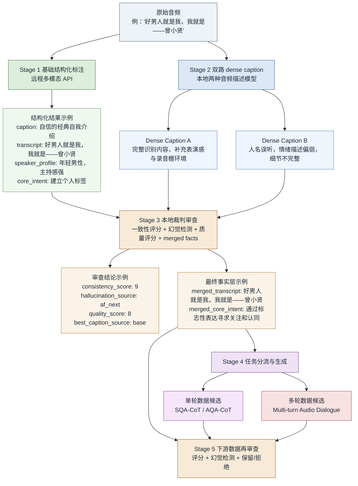
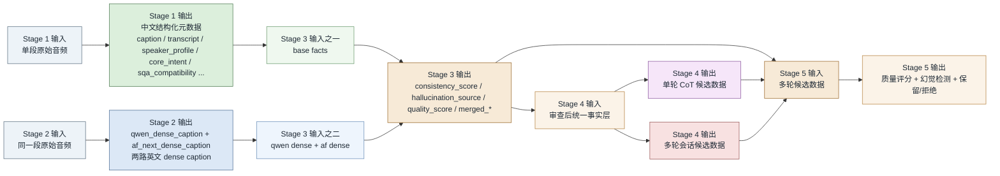

# 单轮共情（带cot）QA数据和多轮多音频QA数据管线

面向语音交互场景，构建具备“音频慢思考”能力的共情、关怀与对话数据体系。该体系强调在推理过程中，重点关注用户语音中的多维信息，包括情绪状态、年龄特征、性别属性、口音差异以及语义意图等，从而实现更细粒度的理解与响应生成。

在此基础上，进一步提升基于音频慢思考机制的多轮、多段语音问答数据质量与覆盖能力，以支持更复杂、更自然的人机对话交互场景。

---

## 1. 项目最终产出的两类数据

这条管线最终不是只产出一份 caption，而是服务两类不同的训练数据：

- 单轮、带思维链的音频理解与回应数据
- 多轮、多段音频的会话数据

先展示终点，有助于理解为什么前面必须经历“结构化标注 - 双路 dense caption - 裁判审查”这几层加工。

### 1.1 单轮 CoT 数据：SQA-CoT 与 AQA-CoT

这类数据面向“听完一段音频后，模型给出一次高质量回应”的场景。它们共享同一条经过审查的事实层，但最终样本本身只需要展示三部分：

- 问题
- CoT 过程
- 最终回答

#### 样例 1：SQA-CoT（更偏共情）

`SQA` 的输入只有一段音频，不额外附带文字问题。问题本身是对“请根据这段音频进行回复”的任务化描述：

```json
{
  "question": "请根据这段第一人称语音输入生成一条适合单轮共情场景的回复。",
  "cot": "这段音频是典型的第一人称表达，说话者直接在讲自己的状态和感受，因此很适合被视为用户发给 AI 的单轮语音。重点不是帮她分析外部事件，而是先接住她当下的疲惫和低落。回复时要避免给出太快的说教或解决方案，而应该先确认她的感受是真实而可以被理解的，再用温和的方式表达陪伴感，给她一点被看见、被接住的感觉。",
  "answer": "听起来你最近是真的有点撑得太久了，不是矫情，也不是想太多，而是整个人已经累到提不起劲了。你愿意把这种状态说出来，其实已经很不容易了。要是你愿意，我可以先陪你把最近最压着你的那件事慢慢说清楚，不用一下子把所有事情都扛住。"
}
```

**作用**

- 训练模型从音频中识别情绪、语气、社交距离感
- 训练模型生成自然、贴合语境的单轮回应
- 强化“听懂之后再回应”，而不是只做转写或摘要

#### 样例 2：AQA-CoT（更偏问答）

`AQA` 的输入是“两部分同时给模型”：

- 一段音频
- 一段围绕这段音频提出的文字问题

这一类样本强调“模型先听音频，再结合文字问题作答”：

```json
{
  "question": {
    "audio": "一段男性激烈质问电台节目的音频",
    "text": "这段音频里他说话时最核心的情绪到底是什么？是在认真提问，还是已经在发泄了？"
  },
  "cot": "先区分表层语义和真实情绪。表层上，这是一句疑问句；但从声音特征看，语速急促、强度偏高、尾音带有明显爆发感，说明说话者并不是在平静地索取答案。接着判断他的真正意图：他是在用质问句式包装情绪宣泄，本质上是在表达对节目内容的强烈不满。最后组织回答时，要把'表面是提问'和'核心是发泄'这两层一起说清，否则会把这段音频误读成普通问答。",
  "answer": "这段音频表面上是在问问题，但情绪核心已经不是理性提问，而是明显的发泄和质问。说话者真正想表达的不是“请你认真回答我”，而是“事情怎么会荒唐成这样”。所以重点情绪更接近愤怒、失望和强烈不耐烦，而不是单纯疑惑。"
}
```

**作用**

- 训练模型围绕音频内容回答问题
- 训练模型把“情绪 - 语义 - 场景”组合起来解释
- 让模型学会先理解音频中的重点，再面向用户提问给出回答

### 1.2 多轮、多段音频会话数据

这类数据参考 `AF-chat` 的形式组织，更接近“多轮 AQA 对话”：用户每一轮通常带着一段音频发起问题，助手在连续上下文中回答。它不只是把多段音频堆在一起，而是把“音频 + 问题 + 回答”串成对话。

从这条管线的目标来看，多轮数据应当建立在“多个经过审查的事实层片段”之上，再按会话顺序重新组织。因此它比单轮 CoT 数据多了三类能力要求：

- 跨轮记忆：模型要记住前一轮说了什么、是什么情绪
- 跨段关联：不同音频片段属于同一人还是同一事件，需要在会话中统一起来
- 回复承接：助手回答不能每一轮都像第一次见到用户

#### 样例：AF-chat 形式的多轮 AQA 对话

```json
{
  "session_id": "session_demo_01",
  "messages": [
    {
      "role": "user",
      "audio": "clip_a",
      "text": "这段音频里他说话为什么这么冲？"
    },
    {
      "role": "assistant",
      "text": "因为他已经不是在平静提问了，而是在借质问句式发泄情绪。声音里的爆发感和咬字力度都说明他对节目内容非常不满。"
    },
    {
      "role": "user",
      "audio": "clip_b",
      "text": "那这一段和上一段比，情绪有什么变化？"
    },
    {
      "role": "assistant",
      "text": "上一段更像情绪爆发，这一段则是在解释爆发背后的原因。也就是说，情绪强度还在，但表达方式已经从直接发泄转向了带解释的抱怨。"
    },
    {
      "role": "user",
      "audio": "clip_c",
      "text": "如果把这三段放在一起看，你觉得这个人更像是单纯生气，还是已经积累很久了？"
    },
    {
      "role": "assistant",
      "text": "更像是积累很久之后的集中爆发。因为对话不是一次性的情绪尖峰，而是在连续几轮里不断重复同一主题：先质问，再解释，再追问根源，这说明不满已经存在了一段时间。"
    }
  ]
}
```

**作用**

- 训练模型处理多轮上下文
- 训练模型跨多段音频追踪同一说话者的情绪变化
- 训练模型生成连续、承接式的对话，而不是每轮都从零理解

## 2. 当前种子数据的来源与数据信息

当前项目新增的研究语料来源，参考 [`research_corpora_inventory.md`](https://github.com/iclovemiku/AF-chat-Pinepline/blob/cursor/reorganize-repo-structure-6b1f/docs/research_corpora_inventory.md) 可以明确分成五套已接入统一管线的主语料，以及后续补充语料。当前五套主语料为：

- `CH-SIMS-v2`
- `CSEMOTIONS`
- `ESD`
- `EmotionTalk`
- `M3ED`

这五套语料在研究语料清单中的总量统计如下：

- `ESD`：35,000 条，约 `29.07` 小时
- `M3ED`：24,455 条，约 `9.83` 小时
- `EmotionTalk`：19,250 条，约 `23.60` 小时
- `CH-SIMS-v2`：5,123 条，约 `5.04` 小时
- `CSEMOTIONS`：4,160 条，约 `10.20` 小时
- 合计：`87,988` 条，约 `77.75` 小时

另外，研究语料清单中还提到 `MCAE-SPPS` 作为补充语料，当前未纳入五语料 manifest。

### 2.1 当前五套主语料的类型信息

根据研究语料清单，这五套主语料的类型可以概括为：

- `ESD`：中文录音室情感句，属于句级情绪录音
- `M3ED`：影视剧对白音频切片，更偏电视剧/网剧对白场景
- `EmotionTalk`：对话棚录语音，带侧车 JSON 元数据
- `CH-SIMS-v2`：多模态短视频片段，声学部分由视频转 WAV 使用
- `CSEMOTIONS`：Hub parquet 解码导出的棚录 WAV

### 2.2 这些种子数据具有什么特点

结合研究语料清单和当前仓库里的中间结果，这批种子数据具有以下特征：

- **语言以中文普通话为主**  
  大量样本是短时中文语音，适合做转写、情绪、意图和场景联合建模。

- **样本长度整体偏短**  
  当前可见样本普遍只有几秒钟，通常是高密度的短句、情绪片段或影视台词片段。这类数据非常适合作为结构化标注和 dense caption 的基础单元。

- **情绪分布明显**  
  样本里既有轻快搭话、平静陈述，也有愤怒质问、夸张表演、激烈宣泄等强情绪表达。这使它天然适合支撑后续的共情、问答和情绪理解任务。

- **场景来源复杂**  
  其中 `ESD`、`EmotionTalk`、`CSEMOTIONS` 更偏棚录或安静室内语音，`M3ED` 更偏影视对白场景，`CH-SIMS-v2` 则是多模态短视频中的混合室内场景。

- **说话风格差异大**  
  既有独白型表达，也有像在对人说话的片段；既有适合伪装成“用户给 AI 发送语音留言”的样本，也有更像节目对白、影视台词或广播片段的样本。

---

## 3. 总体流程：从音频到最终事实层

### 3.1 详细技术链路图



### 3.2 阶段输入输出展开图



---

## 4. 各阶段技术设计

## 4.1 Stage 1：基础结构化标注

**输入**  
单段原始音频。

**输出**  
一组结构化中文元数据。当前核心字段包括：

- `caption`
- `audio_caption`
- `transcript`
- `speech_characteristics`
- `scene_inference`
- `speaker_profile`
- `core_intent`
- `sqa_compatibility`

**完整真实样例**

下面这条样例直接来自当前仓库中的真实 Stage 1 结果，不再做删减：

```json
{
  "caption": "一位年轻男性在安静的室内环境中，以自信且略带表演感的语气说出自己的经典开场白。",
  "audio_caption": "清晰的录音室音质，底噪极低，带有轻微的室内空间混响，人声清晰且无背景杂音。",
  "transcript": "好男人就是我，我就是——曾小贤。",
  "speech_characteristics": "语速平稳且富有节奏感，在名字前有明显的戏剧性停顿，咬字力度适中，听起来充满自信和自我认同感。",
  "scene_inference": "推测为广播电台直播间或影视剧录音棚，环境非常专业且安静。",
  "speaker_profile": "年轻男性，声音清脆，带有明显的主持人或角色扮演风格。",
  "core_intent": "确立个人标签，通过标志性的自我介绍来寻求关注和认同。",
  "sqa_compatibility": "Medium"
}
```

## 4.2 Stage 2：双路 dense caption

**输入**  
与 Stage 1 相同的原始音频。

**输出**  
两路英文 dense caption：

- `qwen_dense_caption`
- `af_next_dense_caption`

它们都在描述同一段音频，但角度和风格并不一样。

**完整真实样例 1：人名误听案例**

下面这组例子直接来自当前仓库的真实中间结果：

```json
{
  "qwen_dense_caption": "The audio clip is a 3.8-second, high-fidelity recording featuring a single male voice, speaking in Mandarin Chinese. The speaker delivers the line, “好男人就是我，我就是曾小贤” (“A good man is me, I am Zeng Xiaoxian”), in a clear, confident, and slightly theatrical manner. The voice is that of a young adult to middle-aged man, with a standard Putonghua accent and a smooth, resonant timbre. The delivery is marked by a slow, deliberate pace, a rising and falling intonation, and a pronounced emphasis on the name “Zeng Xiaoxian,” which is spoken with a slightly lower pitch and a drawn-out, almost performative cadence.\n\nThe recording environment is acoustically controlled, with a faint, consistent background hiss and a subtle, short reverberation, indicating a small-to-medium-sized, hard-surfaced room—likely a studio or a sound booth. There are no other sounds, voices, or background noises present, and the audio is free from distortion, clipping, or digital artifacts.\n\nThe content and style of the speech, combined with the cultural specificity of the name “Zeng Xiaoxian,” strongly indicate that this is a clip from the popular Chinese sitcom *爱情公寓* (*iPartment*), where the character Zeng Xiaoxian is known for his self-proclaimed “good man” persona and this exact catchphrase. The line is delivered in a manner that is both self-assured and subtly humorous, reflecting the character’s personality and the sitcom’s comedic tone.\n\nIn summary, the audio is a clean, studio-quality excerpt of a famous Mandarin catchphrase from a Chinese TV sitcom, performed by a male actor in a controlled recording environment, and is instantly recognizable to fans of the show.",
  "af_next_dense_caption": "A male speaker delivers the line \"好男人就是我，我就\" (\"The good man is me, I am\") in Mandarin Chinese with clear articulation and neutral emotion. The voice has moderate pitch and steady speed, suggesting calm confidence without strong emphasis on particular words.\nBackground sounds:\nNone audible beyond faint room ambience typical of indoor recording environments.\nTranscription:\n好男人就是我 我就是 赵小娴 (Hǎonánrén jiùshì wǒ wǒijiù shì Zēng Xiǎoxiān)\nSpeech characteristics:\nSpeaker gender: Male.\nPitch: Moderate.\nEmotion/Mood: Neutral, confident.\nSpeed: Steady pace.\nDynamics: Consistent volume throughout the short phrase.\nOverall scene impression:\nThis appears as a brief vocal excerpt from a studio-recorded segment featuring a single adult male speaking Mandarin in a controlled environment. No additional context such as dialogue partners, background activity, or setting cues are discernible solely from the provided audio information."
}
```

这个案例能直接看出两路 dense caption 的差异：

- `qwen_dense_caption` 基本听对了内容，也捕捉到了表演感和录音环境
- `af_next_dense_caption` 把关键人名“曾小贤”听成了“赵小娴”，而且整体情绪描述也更弱

**完整真实样例 2：场景脑补案例**

```json
{
  "qwen_dense_caption": "The audio clip begins with a single male voice, speaking in Mandarin Chinese with a standard northern accent, likely from Beijing or a similar region. The speaker’s tone is measured and calm, and he delivers the line: “二十年后的电台节目里” (“In the radio program twenty years from now…”). The recording is of high fidelity, with a clear, resonant voice and a subtle, persistent background hiss, indicating a controlled studio environment. The acoustics are dry, with no echo or room tone, and the voice is centered in the stereo field, suggesting close-mic recording.\n\nImmediately following this, the speaker’s delivery shifts dramatically. His voice rises in pitch and volume, becoming strained and emotionally charged. He exclaims, “就没有一个正常的问题吗？” (“…is there not a single normal question?”), with the final word “吗” (“ma”) delivered as a high-pitched, almost shrieked rhetorical question. This outburst is marked by a rapid increase in loudness, a sharp rise in pitch, and a strained, almost desperate timbre, conveying a sense of frustration and exasperation. The emotional intensity is heightened by the abrupt contrast with the preceding calm, and the delivery is so forceful that it causes mild digital clipping, resulting in a brief harshness at the peak of the shout.\n\nThroughout the clip, there is no background music, ambient noise, or other voices. The only audible elements are the speaker’s voice and the faint hiss of the recording equipment. The speech is delivered in a single, continuous take, with no pauses or edits, and the emotional arc is clearly intentional, moving from measured reflection to explosive frustration.\n\nThe content and style of the speech, combined with the studio-quality recording, strongly suggest that this is a scripted performance, likely from a radio drama, audio play, or similar media. The speaker’s rhetorical question, delivered with such intensity, is designed to evoke a strong emotional response from the listener, highlighting the absurdity or frustration of a hypothetical future scenario. The use of Mandarin with a standard northern accent and the absence of regional markers indicate a broad, national audience, and the production values point to a professional, contemporary setting.\n\nIn summary, the audio clip features a single male voice in a high-fidelity studio recording, delivering a dramatic, emotionally charged rhetorical question in Mandarin Chinese. The performance moves from calm reflection to intense frustration, with no other sounds present, and is clearly intended as a scripted, emotionally impactful moment for a radio or audio drama audience.",
  "af_next_dense_caption": "A male speaker delivers the line \"In radio programs twenty years from now, isn't there even one normal question?\" The voice is clear but slightly muffled by background hiss and low-frequency hum typical of analog tape playback. There's no other discernible dialogue, distinct environmental noise beyond the persistent static-like distortion, and no musical accompaniment. This suggests a single take recorded on vintage media like cassette or vinyl, possibly during a historical broadcast segment where technical artifacts were common."
}
```

这个案例说明，dense caption 不只是会误听词，还可能额外脑补：

- 一路把音频描述成受控录音空间里的情绪化表演
- 另一路则进一步脑补出“模拟磁带播放”“旧广播历史片段”等额外语境

## 4.3 Stage 3：本地裁判审查与事实融合

**输入**  
三路来源同时进入这一阶段：

- Stage 1 的结构化结果
- `qwen_dense_caption`
- `af_next_dense_caption`

**输出**  
这一阶段会同时产生两类结果：

- 审查结论：`consistency_score`、`hallucination_detected`、`hallucination_source`、`quality_score`、`keep_record`、`best_caption_source`
- 最终事实层：`merged_*`

### 完整真实样例 A：人名误听纠正

原始音频内容是：“好男人就是我，我就是——曾小贤。”

**Stage 1 基础结构化结果**

```json
{
  "caption": "一位年轻男性在安静的室内环境中，以自信且略带表演感的语气说出自己的经典开场白。",
  "audio_caption": "清晰的录音室音质，底噪极低，带有轻微的室内空间混响，人声清晰且无背景杂音。",
  "transcript": "好男人就是我，我就是——曾小贤。",
  "speech_characteristics": "语速平稳且富有节奏感，在名字前有明显的戏剧性停顿，咬字力度适中，听起来充满自信和自我认同感。",
  "scene_inference": "推测为广播电台直播间或影视剧录音棚，环境非常专业且安静。",
  "speaker_profile": "年轻男性，声音清脆，带有明显的主持人或角色扮演风格。",
  "core_intent": "确立个人标签，通过标志性的自我介绍来寻求关注和认同。",
  "sqa_compatibility": "Medium"
}
```

**Stage 3 审查结论与 merged facts**

```json
{
  "consistency_score": 9,
  "hallucination_detected": true,
  "hallucination_source": "af_next",
  "hallucination_details": "AF-Next错误地将'曾小贤'转录为'赵小娴'，并且描述中缺乏情感色彩。",
  "quality_score": 8,
  "keep_record": true,
  "rejection_reason": "",
  "best_caption_source": "base",
  "review_notes": "Base和Qwen在关键信息上高度一致，AF-Next存在转录错误和情感描述偏差。",
  "merged_caption": "一位年轻男性在安静的室内环境中，以自信且略带表演感的语气说出自己的经典开场白。",
  "merged_audio_caption": "清晰的录音室音质，底噪极低，带有轻微的室内空间混响，人声清晰且无背景杂音。",
  "merged_transcript": "好男人就是我，我就是——曾小贤。",
  "merged_speech_characteristics": "语速平稳且富有节奏感，在名字前有明显的戏剧性停顿，咬字力度适中，听起来充满自信和自我认同感。",
  "merged_scene_inference": "推测为广播电台直播间或影视剧录音棚，环境非常专业且安静。",
  "merged_speaker_profile": "年轻男性，声音清脆，带有明显的主持人或角色扮演风格。",
  "merged_core_intent": "确立个人标签，通过标志性的自我介绍来寻求关注和认同。",
  "merged_sqa_compatibility": "Medium"
}
```

### 完整真实样例 B：场景与背景音幻觉纠正

原始音频内容是：“二十年后的电台节目里，就没有一个正常的问题吗？”

**Stage 1 基础结构化结果**

```json
{
  "caption": "一名成年男性在带有空间感的环境中，情绪激动地大声质问，表达对电台节目内容的强烈不满。",
  "audio_caption": "室内空间感明显，伴有轻微的混响和环境底噪，人声在大声喊叫时有轻微的过载感。",
  "transcript": "二十年后的电台节目里，就没有一个正常的问题吗？",
  "speech_characteristics": "情绪爆发力强，语速急促，伴有愤怒的咆哮感和极重的咬字力度。",
  "scene_inference": "疑似电台直播间、录音棚或影视剧中的特定场景。",
  "speaker_profile": "中年男性。",
  "core_intent": "极度愤怒的宣泄，对荒诞现状的质问与不满。",
  "sqa_compatibility": "Medium"
}
```

**Stage 3 审查结论与 merged facts**

```json
{
  "consistency_score": 9,
  "hallucination_detected": true,
  "hallucination_source": "af_next",
  "hallucination_details": "AF-Next描述了背景噪音和模拟磁带播放，这可能是虚构的。",
  "quality_score": 8,
  "keep_record": true,
  "rejection_reason": "",
  "best_caption_source": "qwen",
  "review_notes": "Base和Qwen描述一致，Qwen提供了更多细节。AF-Next存在幻觉，但不影响保留记录。",
  "merged_caption": "一名成年男性在带有空间感的环境中，情绪激动地大声质问，表达对电台节目内容的强烈不满。",
  "merged_audio_caption": "室内空间感明显，伴有轻微的混响和环境底噪，人声在大声喊叫时有轻微的过载感。",
  "merged_transcript": "二十年后的电台节目里，就没有一个正常的问题吗？",
  "merged_speech_characteristics": "情绪爆发力强，语速急促，伴有愤怒的咆哮感和极重的咬字力度。",
  "merged_scene_inference": "疑似电台直播间、录音棚或影视剧中的特定场景。",
  "merged_speaker_profile": "中年男性。",
  "merged_core_intent": "极度愤怒的宣泄，对荒诞现状的质问与不满。",
  "merged_sqa_compatibility": "Medium"
}
```

## 4.4 Stage 4：面向任务的数据生成

**输入**  
Stage 3 输出的审查后统一事实层，也就是 `merged_*` 及相关质量结果。

**输出**  
两类候选终端数据：

- 单轮 CoT 候选数据
- 多轮、多段音频会话候选数据

**案例：分流逻辑的直观理解**

- 如果一段音频的 `sqa_compatibility` 较高，且说话者更像是在单向表达、倾诉或主动发起交流，这类样本更适合进入 SQA-CoT。
- 如果一段音频更适合围绕内容本身被提问和解释，它更适合进入 AQA-CoT。
- 如果多段音频之间存在同一说话者、同一事件或明显上下文承接，则更适合被组织成多轮会话数据。

## 4.5 Stage 5：下游数据再审查

**输入**  
Stage 4 生成的候选数据，包括：

- 单轮 `SQA-CoT` / `AQA-CoT` 候选数据
- 多轮 `AF-chat` 形式的会话候选数据

同时，Stage 5 还会把 Stage 3 产出的 `merged_*` 事实层作为参照输入。也就是说，它不是只看“生成出来的数据像不像样”，而是要对照前面已经审查过的音频事实层，判断下游样本有没有偏离原始语义、补出不存在的信息，或者在多轮展开中引入新的幻觉。

**输出**  
这一阶段继续使用裁判模型，对已经生成好的下游样本再做一轮审查，重点不是再回到原始音频重做描述，而是检查“生成出来的数据样本本身是否可靠”。输出可以包含：

- 质量评分
- 幻觉检测
- 保留/拒绝判定
- 审查备注

**审查重点**

- 对单轮数据：
  - 回答是否真的贴合输入音频
  - 是否与 Stage 3 保留下来的 `merged_caption`、`merged_transcript`、`merged_core_intent` 一致
  - `cot` 是否和音频事实层一致，是否出现无根据扩写
  - `answer` 是否过度发挥，写入了音频里没有的信息

- 对多轮数据：
  - 多轮上下文是否前后一致
  - 各轮回答是否仍然受 Stage 3 的统一事实层约束
  - 后轮回答是否误读前轮音频内容
  - 对话里是否出现跨轮幻觉，例如把前面没有说过的事实当成既定信息

**作用方式**

Stage 3 解决的是“原始音频理解结果是否可靠”，Stage 5 解决的是“基于这些理解结果生成出来的数据样本是否仍然可靠”。这样整条链路就形成了两层审查：

- 第一层审查原始音频理解结果
- 第二层审查最终训练数据样本


## 5.上次pc会遗留以及实验验证

5.1多轮多音频数据的人工抽检验证

**核心指标：**

- 精确率：100%
- 召回率：92.6%
- F1 分数：96.2%
- 准确率：96.0%

| **数据类型** | **成功拦截** | **误杀/漏网** |
| ------------ | ------------ | ------------- |
| **优质数据** | 50 (TP)      | 4 (FN)        |
| **幻觉数据** | 46 (TN)      | 0 (FP)        |

5.2 聚类方法的可验证性

引用Audio Flamingo 3英文文献段落，聚类策略的动机与效果：

> Our clustering strategy was informed by a preliminary human study (participant details similar to Section E.1), where participants engaged in multi-audio, multi-turn conversations with an LALM, focused on tasks such as sound design and music information retrieval. We observed that participants naturally gravitated toward using either highly similar or strongly contrasting audio clips within a dialogue. This behavioral insight motivated our use of similar and dissimilar audio clustering.
>
> Empirically, this approach produced dialogues that were more natural, coherent, and diverse compared to those built from randomly selected audio pools. Moreover, AF3-Chat, when trained on this clustered dataset, outperformed the variant trained on randomly selected audio clips, both in terms of response relevance and conversational depth.


## 6.诉求

1.api额度：三个月额度（每个月1万）
