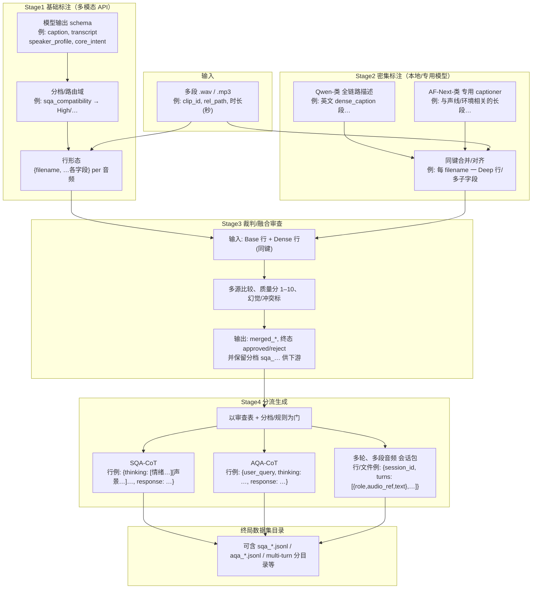

# 多模态音频数据生产管线（说明）

本管线在「原始多段语音 → 可信赖的结构化元数据 → 下游训练样本」的链路上，主要面向两类监督数据产品：**多轮、多段音频的会话样例**，以及**单轮、带思维链（CoT）的共情/问答对**。下文的流程图与 README 中的四阶段划分一致，并在各模块旁用**极短、示意性**的字段/片段（非真实整例）标出**形态示例**，便于对链条中的「可计算对象」有直观把握。

---

## 1. 本管线要生产的两类数据

### 1.1 多轮、多段音频的会话型数据

这类数据面向 **AF（多轮、多段语音）** 的交互式场景：一个训练样本在「会话级」上包含**多轮、每轮可含独立音频**（多音轨/多 `wav` 片段），而不仅是把单条语音打成一条 caption。典型形态包括（示意）：

- **会话与轮次结构**：`session_id`、`turns[]`，每轮有 `turn_id`、`role`（用户/助手/旁白等），以及该轮**关联的音频 id 或路径**（一或多段）。
- **与语音强绑定的语义与风格**：在审查阶段融合得到的 `merged` 元数据上，为每一轮或每一音频生成**符合上下文的回复文本**；可包含对前几轮内容的指代、情绪承接、场景延续。
- **多模态可训练性**：行级结果通常落在 JSON/JSONL 中，可衔接「音频 token + 文本 + 可选时序/说话人 id」的建模需求；数据集中会显式保留「哪一轮对应哪几段物理音频」，以区别于「仅一条长 caption、无多轮键」的样本。

**用途**：多轮、多路音频的指令跟随、长上下文情绪与声景建模、多轮共情/播客式对话的微调等。

### 1.2 单轮、带 CoT 的共情/问答对（SQA-CoT 与 AQA-CoT）

在**同一段**审查通过的元数据上，经配置与标签路由，生成**单轮、文本侧**的样本。二者都以「`thinking` / 思维链 + 面向用户的 `response`」为骨架，但任务设定不同（示意）：

| 子类型 | 侧重 | 行内要点（概念） |
|--------|------|------------------|
| **SQA-CoT** | 高 **sqa_compatibility** 等分档**偏共情/陪伴**的片段 | 强调对用户感受的回应；`response` 多为一段自然、口语化的**共情长回复**；`thinking` 内可含情绪锚定、声景与主体共情、回复策略等分段标签（依提示词设计）。 |
| **AQA-CoT** | 其余分档、偏**「听了一段音频来吐槽/提问」** 的 Q&A | 显式包含 **`user_query`**：模拟用户听完后的口语化问题或感叹；`thinking` 中承接用户情绪、分析客观声学/情境、再**推演**如何以「人味儿」转述；`response` 为对 `user_query` 的回复。 |

**共性**：每行**一条**「模型输入条件（可含从元数据展平的音频描述、转写等）+ 可解析的 JSON 输出（含长思维链与最终话语文本）」；**不**在一条样本内展开多轮多轨的 `turns` 树结构，那是上一小节数据形态负责的部分。

**用途**：单轮场景下的**共情/夜间播客**风格、或「先听懂用户吐槽再给回应」的音频问答，便于与「多轮会话数据」在任务上**互补**、分库存储。

### 1.3 与「REG」/中间表示的关系

从技术上讲，**REG（可检索/可条件生成的「表达式」）**指：多源标注与融合之后，在每一物理音频上得到的**稳定、可版本化**字段集合（如统一转写、说话人/场景/意图的融合视图、分档标签）。**两类最终数据**都不替代这一中间层：多轮多音频样本是在融合结果之上**再**编排多轮与多路引用；单轮 CoT 样本则直接消费融合结果中的文本侧事实与分档。管线**不必**内置真实向量检索，价值在于**字段契约清晰、可审查**，从而两类下游产物共享**同一套事实与质量门槛**。

---

## 2. 数据质量评估（方法维度）

- **多源互证**：远程多模态的表格式结果与一路或多路本地密集描述对照，降低单点幻觉与漏检。
- **关键事实与冲突处理**：在转录、说话人、场景等维度上区分**字面一致**与**仅语义相近**；多源**无法调和**的冲突，通常对融合结论采取**显式缺省/拒收**，避免错监督进入下游。
- **多数与推断规则**：在「两源一致、一源离群」时可用多数票；三源分歧时，仅在**有引文可支撑**时写入推断，并保留**不可判断（cannot_judge 等）** 类标记，使后续生成阶段可**过滤或降级**使用。
- **语言与输出契约**：若 `merged` 等字段需统一为某一自然语言，应在审查规则中**禁止**用非目标语言的「原文复述」替代翻译/改写义务；枚举/分档类标签可按约定使用固定 token，便于 SQA/AQA 分流与统计。

（本节不涉及部署、硬件或排障。）

---

## 3. 全链路流程与模块侧「数据样例」示意

以下流程与项目 README 中的**输入 / Stage1–4 / 最终集** 一致，节点内用**加粗标签 + 极短非真实片段**标出**该处产物的大致长什么样**（便于和 §1 两类终产物对照）。

- **与 §1 的对应**：`S4` 中 `T1`+`T2` 为 **1.2 单轮 CoT 共情/问答** 的两条支路；`T3` 为 **1.1 多轮、多段音频** 的会话向产出。`S1–S3` 的字段与 `merged` 为两类终端形态共享的**事实与质量基座**。

---

## 4. 质量结果：自动与人工（概念）

- **自动侧**：在规则中联合使用「保留/拒绝、各维 cannot_judge、不可调和标志、质量分下界等」，避免**仅凭单一模型分**就放行。可对质量分、幻觉等级、分源分数做**集合级**统计。
- **人工侧**：在提示或模型/规则升级时，用**规模固定的对照子集**对比转录、拒绝率与语言是否退化；对拒绝子集**抽样听音+对照引文**，区分「合理拒收」与**需回修规则/数据** 的情况。正式报告时建议**自动统计与人工样本表**并列，避免只依赖单一路径。

---

## 5. 可演进方向（与任务相关）

- **表示层**：在融合结果之上增加**可选后处理**（如长度截断、语言门控、拒绝原因的可读摘要），与模型前向解耦。  
- **配置化**：将一致性、质量、是否将某类 `cannot_judge` 视为**硬条件**等写入**策略/配置**，便于 A/B 与多产品线复用。  
- **多轮与多段**：在单段管线稳态后，可在会话级补充**轮次、说话人 id、多音轨时序**等规范，并在审查中单独约定**指代与事实**跨轮一致性。  
- **与下游检索/嵌入**：若需要向量检索，可在**并行流水线**中把 `merged` 表映射为检索用 schema 或派生 embedding，不替代 JSONL 的**可审计**主存储。

---

*本文为方法与数据产品说明，具体字段名、目录名与某次跑批的统计以对应实验记录为准。*
